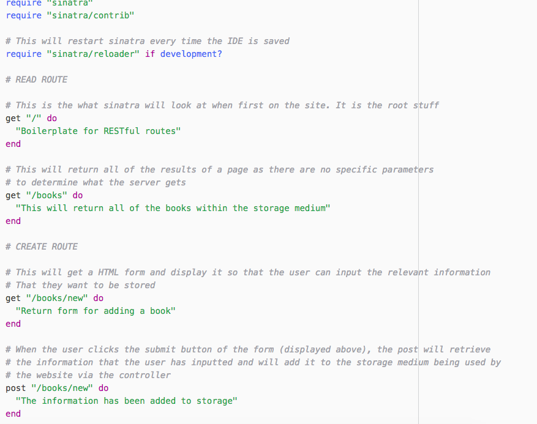

# 7 RESTful Routes Boilerplate

## Requirements

- [x] Recreate all 7 RESTful routes
- [x] Make them different to what was taught in lesson
- [x] Write descriptive comments about what each route does
- [x] Test the routes to make sure they work as intended
- [x] Use sinatra to host the Routes

## Result

